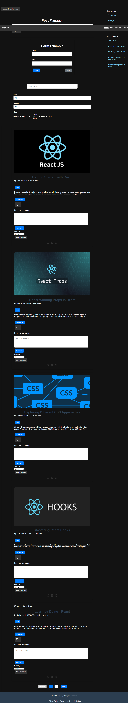

# My React Blog

A blog platform built with React and Vite.

## Setup Instructions

1. Clone the repository - https://github.com/mrudula-n/react-blog.git
2. Run `npm install`
3. Run `npm run dev`
4. Open http://localhost:5173 in your browser

## Assignment 0

### Project Structure

my-blog/
├── node_modules/ # Contains all the npm packages required by the project (auto-generated, do not modify)
├── public/ # Folder for static assets like images, fonts, etc.
├── src/ # Contains all your application source code
│ ├── assets # Stores static assets like images, icons, and other resources that are needed across the application
│ ├── components/ # Folder for reusable components (e.g., Header.jsx)
│ ├── App.css # Contains CSS specific to the App component
│ ├── App.jsx # Main application component that ties everything together
│ ├── main.jsx # Application entry point where React is rendered into the DOM
│ └── index.css # Global styles for the application
├── .gitignore # Specifies files and directories that Git should ignore
├── eslint.config.js # Configures ESLint, a tool that analyzes your code to find and fix issues based on coding standards
├── index.html # The main HTML file that serves as the entry point for the React application
├── package-lock.json # Locks the exact versions of dependencies and their sub-dependencies for consistent installations
├── package.json # Project configuration file, listing dependencies, scripts, and metadata
├── vite.config.js # Vite configuration file for build and dev server settings
└── README.md # Documentation for the project, including setup instructions

### Screenshot

### What I Learned

1. Understanding Vite
2. Setting up a React project with Vite
3. Using reusable components

## Assignment 1

### Components Structure

- BlogPost: Individual blog post display
- BlogList: Container for multiple posts
- Header: Navigation and site title

### Styling Approach

I used **CSS Modules** for styling. This approach provides locally scoped styles, which prevents conflicts and makes each component’s styles self-contained. Each component has its own CSS Module file, keeping our styles modular and easy to maintainwithout any complexity.

### New Features

- **Individual Blog Post Display**: Display each blog post with title, author, date, read time, and content.
- **Blog Post List**: Renders multiple blog posts from an array of post data.
- **Responsive Design**: Adjusts layout and typography for different screen sizes.
- **Prop Validation**: Use `PropTypes` to enforce correct prop types for each component.

### Screenshots

#### Desktop

##### Mobile

## Assignment 2

### New Features

- Like Button: Toggle likes with real-time count updates and visual feedback.
- Comment Section: Add, display, and manage comments with timestamps and toggle visibility.
- Read Time Estimator: Calculate and display estimated read time for blog content.
- Read More/Read Less: Toggle between truncated and full content views.
- Efficient State Management: Update and manage component state dynamically with React hooks.
- Styling and Accessibility: Responsive design with accessible controls and labels.

### Screenshots

## Assignment 3

### New Features

**Post Editor Form**
- Collects post details (title, content, tags, category, publish status).
- Handles controlled components for managing form state.

**Form Validation**
- Validates input fields (title, content, tags) with error messages.
- Supports validation on change, blur, and submit events.

**Rich Text Editor**
- Allows formatting options: bold, italic, and heading.
- Updates content dynamically based on user selection.

**Tag Management**
- Add tags using the Enter key.
- Remove tags via a delete button.
- Prevent duplicate or empty tags.

**Dynamic Form Handling**
- Handles checkbox, text, textarea, and select inputs.
- Toggles publish state and adjusts the submit button label dynamically.

**Error Handling**
- Displays error messages for invalid fields.
- Maintains per-field validation state.

**State Persistence**
- Manages form data with React's useState to preserve state updates.

### Screenshots

## Assignment 4

### New Features

**Search Functionality**
- Debounced input to prevent excessive filtering during typing.
- Multi-field search across titles and content.
- Real-time results count display.

**Filters**
- Category Filter: Filter posts by selected category.
- Author Filter: Narrow posts down by author.
- Tag Filters: Enable multi-tag selection for refined results.
- Combine multiple filters (category, author, tags).

**Pagination**
- Navigate between pages of results.
- Define items per page with dynamic result slicing.
- Show current page and total pages.

**Custom Hooks**
- useSearch: Reusable logic for search, including debouncing and result computation.
- useFilters: Reusable logic for filtering items based on multiple criteria.

**Performance Optimizations**
- Memoization of filtered items, categories, authors, and tags using useMemo.
- Debounced search term update for smoother interactions.

**Error and Loading States**
- Display "No results found" when no posts match criteria.
- Maintain user-friendly states during data updates.

### Screenshots

## Assignment 5

### New Features

#### Routing System
- **Basic Routing:** Implements routes for home, blog posts, profile, and error handling.
- **Nested Routes:** Supports routes under a parent route (e.g., /posts with child routes like :id and new).
- **Dynamic Routes:** Uses parameters like :id for rendering specific blog post details.

#### Layout System
- **Shared Layout:** A consistent structure with a header, main content, sidebar, and footer.
- **Responsive Design:** Adapts the layout for desktop and mobile screens using CSS Grid and media queries.
- **Dynamic Content Area:** Renders child routes dynamically within the layout using Outlet.

#### Navigation
- **Dynamic Menu:** Provides links to main routes with active state highlighting.
- **Mobile Menu:** Includes a responsive hamburger menu for small screens.
- **Accessible Navigation:** Uses ARIA attributes for better accessibility.

#### Sidebar
- **Categories Section:** Displays navigable categories for filtering posts.
- **Recent Posts:** Lists recent blog posts with navigation to their details.

#### Error Handling
- **Not Found Page:** Custom 404 error page for invalid routes with navigation options.
- **Error Boundaries:** Captures and displays detailed errors using useRouteError.

### Screenshots

#### Desktop

#### Mobile

## Assignment 6

### New Features
1. Data Management (usePosts)
- CRUD Operations: Add, update, delete posts.
- Likes & Comments: Increment likes and add comments with metadata.
- Persistent Storage: Syncs posts with localStorage.
- State Management: Handles loading and error states.
2. Form Management (useForm)
- State Handling: Manages form values, errors, and touched fields.
- Validation: Validates fields on blur and the entire form on submit.
- Reusable Handlers: Provides onChange, onBlur, and onSubmit.
3. Authentication (useAuth)
- User Management: Login, logout, and profile update.
- Persistent User Data: Syncs user data with localStorage.
- Auth State: Tracks authentication and loading states.
4. Theme Management (useTheme)
- Dark/Light Modes: Toggles between themes.
- Persistent Theme: Syncs theme preference with localStorage.
- Dynamic Application: Applies theme to the document.
5. Pagination (usePagination)
- Paginated Items: Splits data into pages.
- Navigation: Provides next, previous, and specific page navigation.
- Pagination Info: Tracks current and total pages.
6. Testing
- Unit Tests: Validates functionality of usePosts.
- Behavior Testing: Tests edge cases and state updates.

#### Screenshots

## Assignment 7

### New Features
- Theme Switching: Enables users to toggle between light and dark themes, dynamically updating global CSS variables for colors, typography, and spacing.
- User Preferences Management: Manages user-specific settings like font size, reduced motion, language, and layout density, with persistent storage in localStorage.
- Global State Management: Centralizes the state for blog posts, categories, and tags using BlogContext and useReducer, handling loading, errors, and CRUD operations.
- Reusable Context Providers: Provides Theme, Preferences, and Blog contexts as modular providers, combined into a single AppProviders wrapper for easy integration.
- Settings Interface: Offers a UI for users to configure preferences and toggle themes, including reset functionality to restore default settings.
- State Persistence: Stores theme and user preferences in localStorage, ensuring settings persist across user sessions.
- Testing Scenarios: Provides comprehensive unit tests for context behavior, state updates, and user interactions like theme toggling and preference management.

### Screenshot

